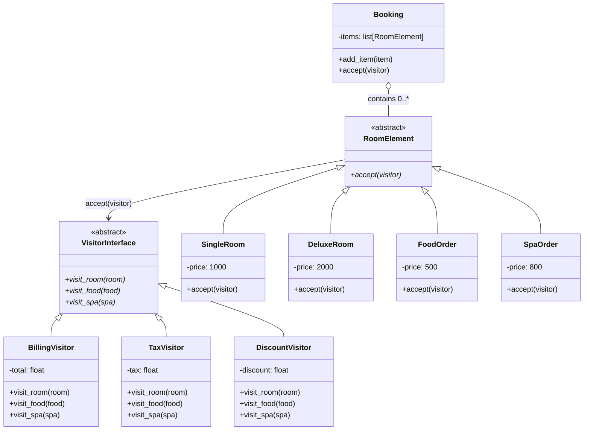

# Hotel Booking System - Visitor Design Pattern

## Overview

This module demonstrates the Visitor behavioural design pattern using a hotel booking domain.
A booking contains multiple service items (rooms, food, spa). Different operations such as total billing,
tax calculation, and discount calculation are implemented as visitors, without changing the item classes.

## Visitor Pattern Mapping

| Pattern Role | Implementation |
|---|---|
| Element Interface | `RoomElement` |
| Concrete Elements | `SingleRoom`, `DeluxeRoom`, `FoodOrder`, `SpaOrder` |
| Visitor Interface | `VisitorInterface` |
| Concrete Visitors | `BillingVisitor`, `TaxVisitor`, `DiscountVisitor` |
| Object Structure | `Booking` |

## UML Class Diagram (ASCII)

```
                     +-------------------------+
                     |      <<abstract>>       |
                     |      VisitorInterface   |
                     +-------------------------+
                     | + visit_room(room)      |
                     | + visit_food(food)      |
                     | + visit_spa(spa)        |
                     +------------+------------+
                                  ^
                                  |
          +-----------------------+-----------------------+
          |                       |                       |
+----------------------+ +----------------------+ +----------------------+
|    BillingVisitor    | |      TaxVisitor      | |   DiscountVisitor    |
+----------------------+ +----------------------+ +----------------------+
| - total: float       | | - tax: float         | | - discount: float    |
+----------------------+ +----------------------+ +----------------------+
| + visit_room(...)    | | + visit_room(...)    | | + visit_room(...)    |
| + visit_food(...)    | | + visit_food(...)    | | + visit_food(...)    |
| + visit_spa(...)     | | + visit_spa(...)     | | + visit_spa(...)     |
+----------------------+ +----------------------+ +----------------------+


                     +-------------------------+
                     |      <<abstract>>       |
                     |       RoomElement       |
                     +-------------------------+
                     | + accept(visitor)       |
                     +------------+------------+
                                  ^
                                  |
       +--------------+-----------+-----------+--------------+
       |              |                       |              |
+---------------+ +---------------+   +---------------+ +---------------+
|   SingleRoom  | |   DeluxeRoom  |   |   FoodOrder   | |   SpaOrder    |
+---------------+ +---------------+   +---------------+ +---------------+
| - price=1000  | | - price=2000  |   | - price=500   | | - price=800   |
+---------------+ +---------------+   +---------------+ +---------------+
| + accept(v)   | | + accept(v)   |   | + accept(v)   | | + accept(v)   |
+---------------+ +---------------+   +---------------+ +---------------+


+------------------------------+
|           Booking            |
+------------------------------+
| - items: list[RoomElement]   |
+------------------------------+
| + add_item(item)             |
| + accept(visitor)            |
+------------------------------+
```

## Mermaid UML



## Interaction Flow

1. `Booking` stores all selected items.
2. `Booking.accept(visitor)` iterates through each item.
3. Each item calls `item.accept(visitor)`.
4. Double dispatch occurs: item chooses the right visitor method (`visit_room`, `visit_food`, `visit_spa`).
5. Each visitor computes its own concern independently:
   - `BillingVisitor`: total amount
   - `TaxVisitor`: total tax
   - `DiscountVisitor`: total discount

## File Structure

```
hotel_booking_using_visitor_dp/
|-- app.py
|-- booking.py
|-- room_element_interface.py
|-- rooms.py
|-- visitor_interface.py
|-- visitors.py
|-- output.txt
```

## How to Run

```bash
cd behavioural_design_patterns/hotel_booking_using_visitor_dp
python app.py
```

## Sample Output

```
All services total: 3300
Tax: 481.0
Discount: 345.0
Total: 3300 + 481.0 - 345.0
```

## Why Visitor Here

- New operations can be added by introducing a new visitor class.
- Item classes stay stable and focused on their core data.
- Business logic (billing, taxes, discounts) is cleanly separated.
- Works well when the element set is relatively stable but operations evolve over time.
