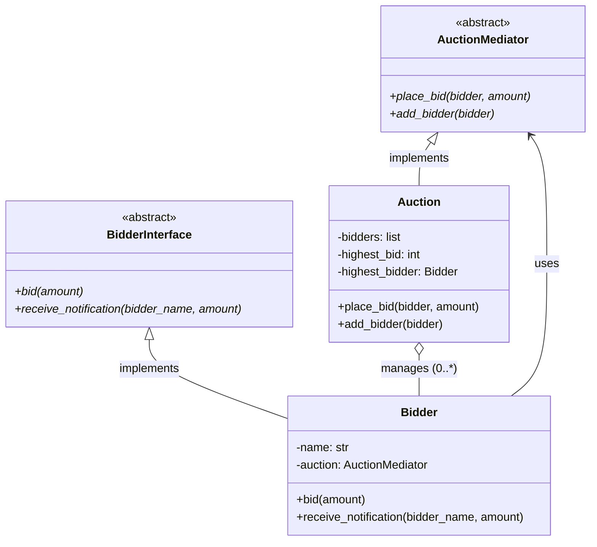

# Online Auction System — Mediator Design Pattern

## Overview

This module implements an **Online Auction System** using the **Mediator behavioural design pattern**. Instead of bidders communicating directly with each other, all bid-related communication is routed through a central `Auction` mediator. When a new highest bid is placed, the mediator notifies all other registered bidders automatically.

---

## Mediator Pattern — Key Idea

> Define an object that encapsulates how a set of objects interact. The mediator promotes loose coupling by keeping objects from referring to each other explicitly, and lets you vary their interaction independently.

| Role | Class |
|---|---|
| Mediator Interface | `AuctionMediator` |
| Concrete Mediator | `Auction` |
| Colleague Interface | `BidderInterface` |
| Concrete Colleague | `Bidder` |

---

## UML Class Diagram

```
┌─────────────────────────────────┐
│        <<abstract>>             │
│        AuctionMediator          │
├─────────────────────────────────┤
│ + place_bid(bidder, amount)     │
│ + add_bidder(bidder)            │
└──────────────┬──────────────────┘
               │ implements
               ▼
┌─────────────────────────────────┐
│            Auction              │
├─────────────────────────────────┤
│ - bidders: List[Bidder]         │
│ - highest_bid: int              │
│ - highest_bidder: Bidder        │
├─────────────────────────────────┤
│ + place_bid(bidder, amount)     │  ◄──── notifies all other bidders
│ + add_bidder(bidder)            │
└──────────────┬──────────────────┘
               │ holds reference to (0..*)
               │
               ▼
┌─────────────────────────────────┐        ┌─────────────────────────────────┐
│        <<abstract>>             │        │            Bidder               │
│        BidderInterface          │        ├─────────────────────────────────┤
├─────────────────────────────────┤        │ - name: str                     │
│ + bid(amount)                   │◄───────│ - auction: AuctionMediator      │
│ + receive_notification(         │        ├─────────────────────────────────┤
│       bidder_name, amount)      │        │ + bid(amount)                   │
└─────────────────────────────────┘        │ + receive_notification(         │
                                           │       bidder_name, amount)      │
                                           └─────────────────────────────────┘
```

### Mermaid Class Diagram



---

## Sequence Diagram

```
Bidder (Messi)       Auction (Mediator)      Bidder (Neymar)     Bidder (Ronaldo)
      │                      │                      │                    │
      │── bid(100) ─────────►│                      │                    │
      │                      │── receive_notification("Messi", 100) ────►│
      │                      │── receive_notification("Messi", 100) ────────────────►│
      │                      │                      │                    │
      │                      │◄── bid(200) ─────────│                    │
      │◄── receive_notification("Neymar", 200) ─────│                    │
      │                      │── receive_notification("Neymar", 200) ────────────────►│
      │                      │                      │                    │
      │                      │◄── bid(1000) ─────────────────────────────│
      │◄── receive_notification("Ronaldo", 1000) ───│                    │
      │                      │── receive_notification("Ronaldo", 1000) ──│
```

---

## File Structure

```
online_auction_using_mediator_dp/
├── auction_mediator.py   # Abstract Mediator interface
├── auction.py            # Concrete Mediator — manages bidders & bids
├── bidder_interface.py   # Abstract Colleague interface
├── bidder.py             # Concrete Colleague — places bids & receives notifications
├── app.py                # Entry point / demo
└── output.txt            # Sample output
```

---

## How to Run

```bash
cd behavioural_design_patterns/online_auction_using_mediator_dp
python app.py
```

### Sample Output

```
Messi bids 100
Highest bid received is 100 from Messi
Neymar notified:Messi placed bid 100
Ronaldo notified:Messi placed bid 100
Neymar bids 200
Highest bid received is 200 from Neymar
Messi notified:Neymar placed bid 200
Ronaldo notified:Neymar placed bid 200
Ronaldo bids 1000
Highest bid received is 1000 from Ronaldo
Messi notified:Ronaldo placed bid 1000
Neymar notified:Ronaldo placed bid 1000
```

---

## Design Benefits

- **Loose coupling** — `Bidder` objects never reference each other; they only know about the `AuctionMediator`.
- **Single responsibility** — All bid coordination logic lives in `Auction`, not spread across bidders.
- **Open/Closed** — New bidder types can be added without touching `Auction` or other bidders.
- **Easy to extend** — Reserve price, bid history, or auction end logic can be added solely to `Auction`.
