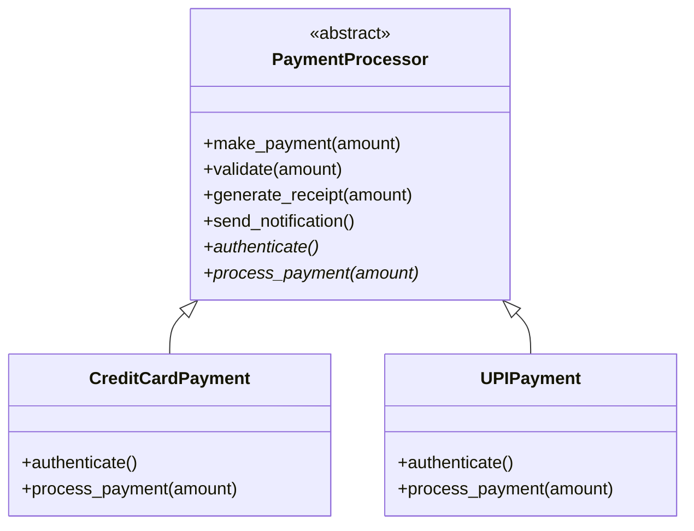

# Payment Method using Template Method Pattern

## Overview

This example demonstrates the **Template Method** behavioural design pattern for payment processing.
A base class defines the fixed sequence of payment steps, while subclasses customize specific steps like authentication and payment execution.

The shared payment flow is:
1. Validate amount
2. Authenticate
3. Process payment
4. Generate receipt
5. Send notification

## Pattern Mapping

| Pattern Role | Class |
|---|---|
| Abstract Class (Template) | `PaymentProcessor` |
| Concrete Class | `CreditCardPayment` |
| Concrete Class | `UPIPayment` |

## Class Responsibilities

### `PaymentProcessor` (Abstract Template)
- Defines `make_payment(amount)` template method.
- Provides default implementations for:
  - `validate(amount)`
  - `generate_receipt(amount)`
  - `send_notification()`
- Declares abstract methods that subclasses must implement:
  - `authenticate()`
  - `process_payment(amount)`

### `CreditCardPayment`
- Implements authentication using OTP.
- Implements card payment processing logic.

### `UPIPayment`
- Implements authentication using UPI PIN.
- Implements UPI debit processing logic.

## UML Class Diagram (ASCII)

```
+----------------------------------------+
|        <<abstract>> PaymentProcessor   |
+----------------------------------------+
| + make_payment(amount)                 |
| + validate(amount)                     |
| + generate_receipt(amount)             |
| + send_notification()                  |
| + authenticate()*                      |
| + process_payment(amount)*             |
+-------------------+--------------------+
                    ^
                    |
        +-----------+-----------+
        |                       |
+---------------------+  +------------------+
|  CreditCardPayment  |  |    UPIPayment    |
+---------------------+  +------------------+
| + authenticate()    |  | + authenticate() |
| + process_payment() |  | + process_payment|
+---------------------+  +------------------+
```

## Mermaid UML



## Execution Flow

When `make_payment(amount)` is called, the base class controls the algorithm order. Subclasses only provide method-specific behavior.

Example:
- For `CreditCardPayment`: OTP authentication + card charge
- For `UPIPayment`: UPI PIN authentication + UPI debit

## File Structure

```text
payment_method_using_template_dp/
|-- app.py
|-- payment_abstract.py
|-- payments.py
|-- output.txt
```

## How to Run

```bash
cd behavioural_design_patterns/payment_method_using_template_dp
python app.py
```

## Sample Output

```text
Payment validated
Authenticating using OTP
Charging ₹1000 to Credit Card
Receipt generated for ₹1000
Payment notification sent

Payment validated
Authenticating using UPI PIN
Debiting ₹500 through UPI
Receipt generated for ₹500
Payment notification sent
```

## Why Template Method Here

- Keeps process sequence consistent across all payment types.
- Avoids code duplication for common steps.
- Allows easy extension by adding new payment classes.
- Enforces a clear contract for payment-specific behavior.
