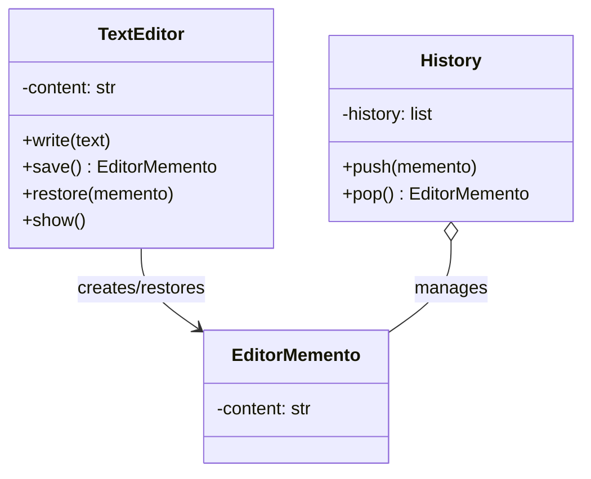

# Text Editor using Memento Design Pattern

## Overview

This module demonstrates the Memento behavioural design pattern using a simple text editor with undo capability.
The pattern allows saving and restoring the editor's state without exposing its internal structure to the outside world.

In this example:
- The `TextEditor` acts as the Originator—it creates snapshots of its content state.
- The `EditorMemento` stores the captured state (content).
- The `History` class acts as the Caretaker—it manages a stack of mementos for undo/redo operations.

## Memento Pattern Roles

| Role | Class | Responsibility |
|---|---|---|
| Originator | `TextEditor` | Creates mementos of its state; can restore from a memento |
| Memento | `EditorMemento` | Stores a snapshot of the originator's state at a point in time |
| Caretaker | `History` | Manages a collection of mementos (e.g., undo/redo stack) |

## How It Works

1. User writes text to the editor.
2. Editor's state is saved as a memento and pushed onto the history stack.
3. More text is written.
4. User can undo by popping the most recent memento from history.
5. Editor restores its previous state from the popped memento.
6. User sees the editor revert to that earlier state.

## UML Class Diagram (ASCII)

```
+----------------------------+
|       TextEditor           |
+----------------------------+
| - content: str             |
+----------------------------+
| + write(text: str)         |
| + save(): EditorMemento    |
| + restore(memento)         |
| + show()                   |
+----------------------------+
         |
         | creates/restores
         |
         v
+----------------------------+
|     EditorMemento          |
+----------------------------+
| - content: str             |
+----------------------------+

+----------------------------+
|       History              |
+----------------------------+
| - history: List[Memento]   |
+----------------------------+
| + push(memento)            |
| + pop(): Memento           |
+----------------------------+
         ^
         |
         | holds
         |
    (stack of mementos)
```

## Mermaid UML



## Sequence Flow

```text
User          TextEditor        EditorMemento        History
 |                 |                  |                 |
 |-- write("Hey")--|                  |                 |
 |                 |                  |                 |
 |-- save() -------|-- create --------|                 |
 |                 |<-- Memento ------|                 |
 |<-- Memento -----|                  |                 |
 |                 |                  |                 |
 |-- push(memento) |                  |<-- store ------|
 |                 |                  |                 |
 |-- write(" Shipra") --|             |                 |
 |                 |                  |                 |
 |-- undo() -------|                  |                 |
 |-- pop() --------|                  |                 |
 |                 |                  |<-- retrieve ----|
 |<-- Memento --------|                  |                 |
 |                 |                  |                 |
 |-- restore(Memento) |                  |                 |
 |                 |<-- restore state ----|                 |
 |                 |                  |                 |
```

## File Structure

```text
text_editor_using_memento_dp/
|-- app.py
|-- originator.py
|-- editor_memento.py
|-- caretaker.py
|-- output.txt
```

## How to Run

```bash
cd behavioural_design_patterns/text_editor_using_memento_dp
python app.py
```

## Sample Output

```text
Hey Shipra!!!
Hey Shipra
Hey
```

### Explanation of Output

1. First line: "Hey Shipra!!!" — after writing all three segments without undo.
2. Second line: "Hey Shipra" — after first undo.
3. Third line: "Hey" — after second undo.

## Design Benefits

- **Encapsulation** — The memento captures state without exposing implementation details.
- **Undo/Redo** — History can easily implement undo and redo stacks.
- **State Snapshots** — Multiple snapshots can be saved at different points in time.
- **Clean API** — The caretaker doesn't need to know how the originator works internally.
- **Time Travel** — Easy to jump to any saved state.

## When to Use Memento

- Implementing undo/redo functionality
- Saving checkpoints in transactions
- Snapshot-based state restoration
- Implementing save-games in applications
- Time-travel debugging
