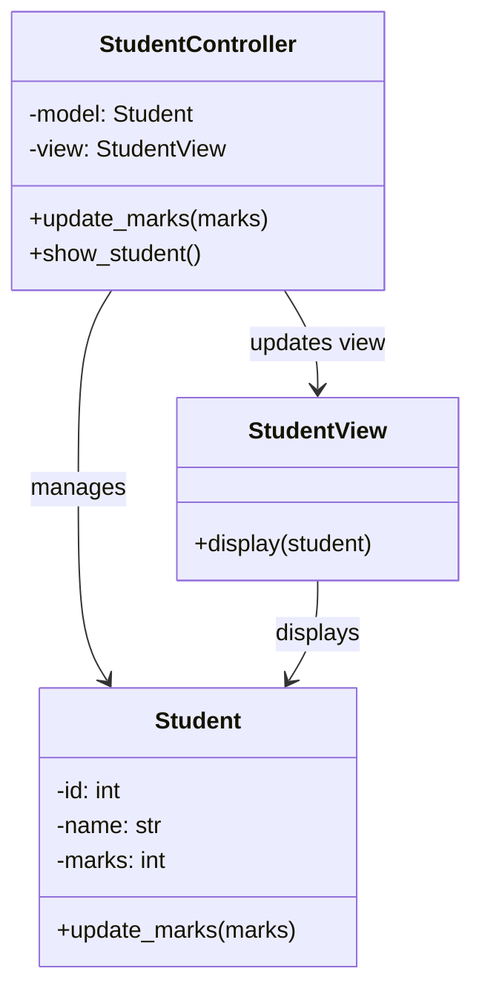

# MVC Design Pattern Example

## Overview

This module demonstrates the Model-View-Controller (MVC) design pattern using a simple student record example.
The design separates data management, presentation, and application logic into distinct components.

In this example:
- The model stores student data.
- The view renders student details.
- The controller coordinates updates between the model and the view.

## Components

### Model
`Student` in `models.py`

Responsibilities:
- Stores student data: `id`, `name`, and `marks`
- Provides behavior to update marks

### View
`StudentView` in `views.py`

Responsibilities:
- Displays student information
- Knows how to present the model, but does not modify it

### Controller
`StudentController` in `controllers.py`

Responsibilities:
- Receives requests from the application
- Updates the model
- Passes the model to the view for display

## How It Works

1. The application creates a `Student` model.
2. The application creates a `StudentView`.
3. A `StudentController` is created with both the model and the view.
4. The controller displays the student details using the view.
5. The controller updates the student's marks in the model.
6. The controller displays the updated details again.

## UML Class Diagram

### ASCII UML

```
+------------------------+
|        Student         |
+------------------------+
| - id: int              |
| - name: str            |
| - marks: int           |
+------------------------+
| + update_marks(marks)  |
+------------------------+

+-------------------------------+
|         StudentView           |
+-------------------------------+
| + display(student: Student)   |
+-------------------------------+

+-----------------------------------------------+
|               StudentController               |
+-----------------------------------------------+
| - model: Student                              |
| - view: StudentView                           |
+-----------------------------------------------+
| + update_marks(marks)                         |
| + show_student()                              |
+-----------------------------------------------+
```

### Mermaid UML



## Sequence Flow

```text
Application -> StudentController: show_student()
StudentController -> StudentView: display(model)
StudentView -> Console: print student details

Application -> StudentController: update_marks(95)
StudentController -> Student: update_marks(95)

Application -> StudentController: show_student()
StudentController -> StudentView: display(model)
StudentView -> Console: print updated student details
```

## File Structure

```text
mvc_dp/
|-- app.py
|-- controllers.py
|-- models.py
|-- views.py
|-- output.txt
```

## How to Run

```bash
cd mvc_dp
python app.py
```

## Sample Output

```text
Student details
Student ID: 1
Student Name: Shipra
Student Marks: 49
After updating marks
Student details
Student ID: 1
Student Name: Shipra
Student Marks: 95
```

## Benefits of MVC

- Separation of concerns keeps code easier to maintain.
- The view can change without changing business logic.
- The model can evolve independently of presentation.
- The controller centralizes application behavior.
- The pattern scales better than mixing input, logic, and output in one file.

## Current Example Notes

This example is intentionally small and demonstrates the basic collaboration between MVC components.
In a larger application, the controller could handle validation, multiple views, and more complex model operations.
